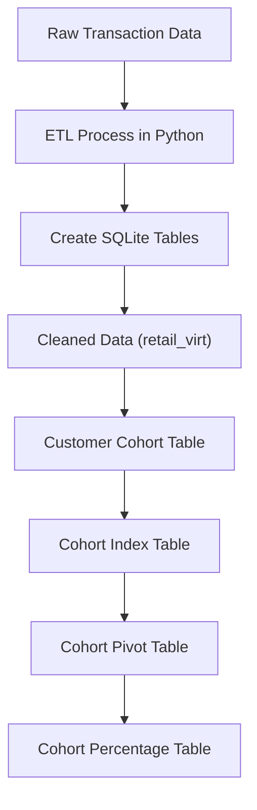
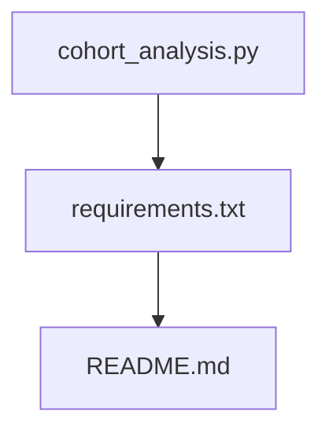

# 🧮 Customer Cohort Analysis with Python & SQLite

A complete end-to-end **Cohort Analysis Pipeline** project that uses **Python (Pandas)** and **SQLite** to perform customer segmentation and retention analysis from raw transactional data.

This project demonstrates how to clean retail data, create cohorts based on first purchase dates, compute cohort indexes, and visualize customer retention trends over time using SQL.

---

## 📌 Project Objectives

- Clean and preprocess online retail transaction data.
- Build a modular, reusable ETL pipeline using Python and SQL.
- Group customers into cohorts based on their first purchase month.
- Analyze customer retention over a 12-month period.
- Output cohort retention matrices and percentage tables.

---

## 🛠️ Technologies Used

- **Python** (Pandas, SQLite3)
- **SQLite** (In-memory SQL operations)
- **SQL** (CTEs, window functions, date manipulation)
- **Jupyter Notebook** or **Python IDE**
- **Excel/Google Sheets** *(optional for visualization)*

---

## 🔄 Pipeline Overview



---

## 📂 Project Structure

---

## 📈 SQL Logic Breakdown

### ✅ Data Cleaning & Filtering
- Remove null `CustomerID`
- Remove rows with `Quantity <= 0` or `UnitPrice <= 0`
- Deduplicate using `ROW_NUMBER()` over `InvoiceNo`, `StockCode`, and `Quantity`

### 🧠 Cohort Creation
- Use `MIN(InvoiceDate)` to find first purchase
- Extract cohort month with `strftime('%Y-%m-01', ...)`

### 🔁 Cohort Index Calculation
- Compute difference in months between invoice and cohort dates
- `cohort_index = (year_diff * 12 + month_diff + 1)`

### 📊 Cohort Matrix and Percentage
- Use `COUNT(DISTINCT CustomerID)` grouped by `cohort_index`
- Normalize to percentages over the first month’s customer count

---

## 📌 Sample Output

| Cohort Date | 1st_purchase | >_1 | >_2 | >_3 | >_4 | >_5 |
|-------------|---------------|-----|-----|-----|-----|-----|
| 2010-12-01  | 885           | 324  | 286  | 340  | 321  | 352  |
| 2011-01-01  | 417           | 92  | 111   | 96  | 134  | 120  |

---

## 🚀 How to Run

1. **Clone the repo:**

```bash
git clone https://github.com/your-username/cohort-analysis.git
cd cohort-analysis
```
2. **Run the python script**:
```bash
python cohort_analysis.py
```

## 📄 Downloadable Output Files

You can download the final output of this project below:

- 📊 [Cohort Pivot Table CSV](https://github.com/your-username/cohort-analysis/blob/main/cohort_pivot.csv)
- 📉 [Cohort Percentage Table CSV](https://github.com/your-username/cohort-analysis/blob/main/cohort_percent.csv)

